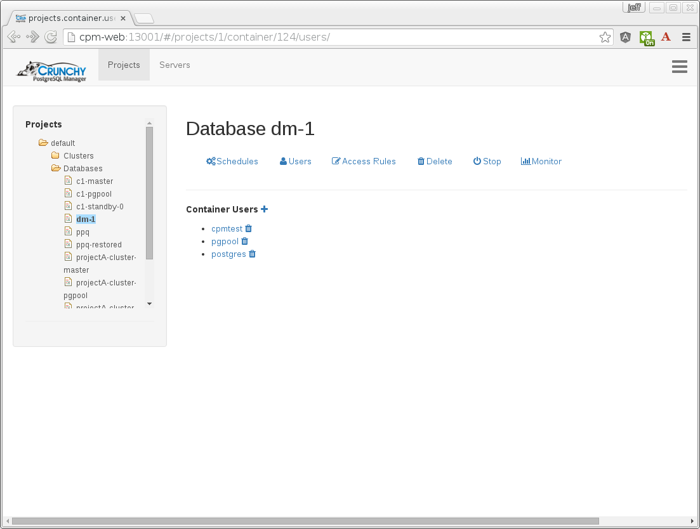
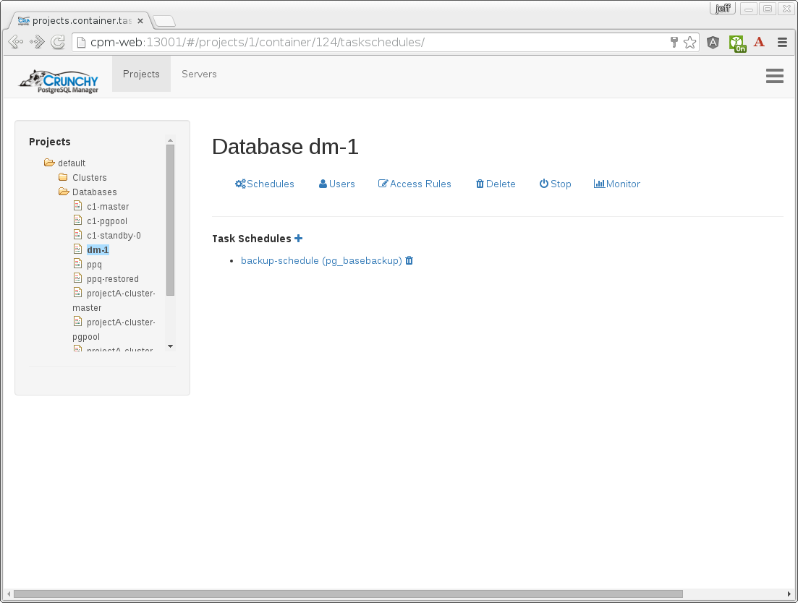
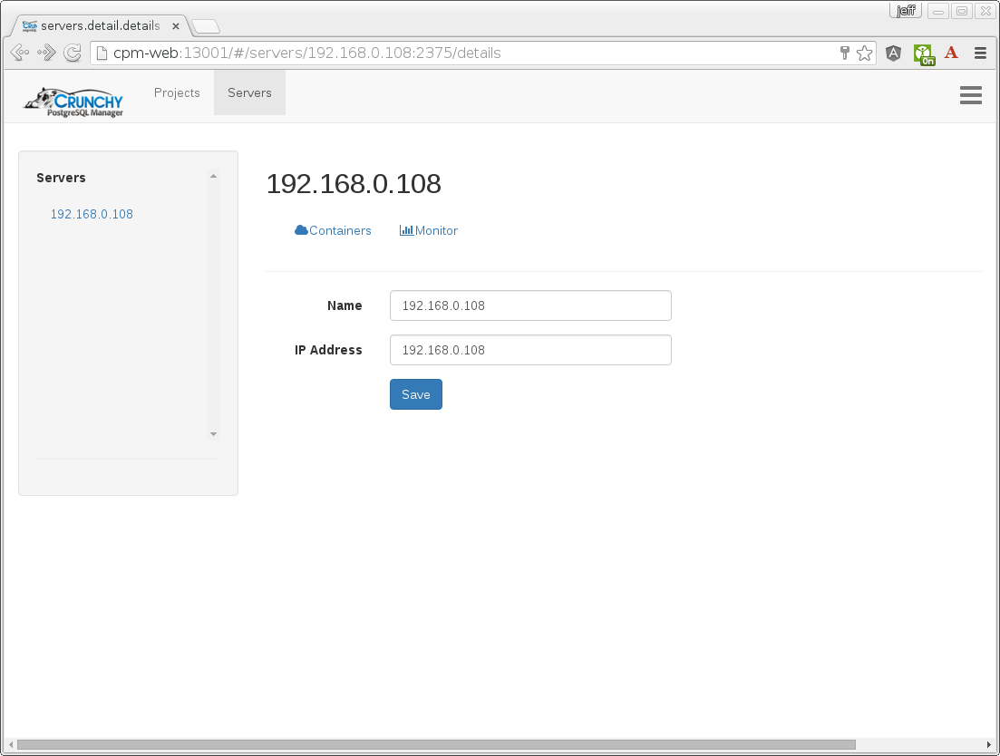
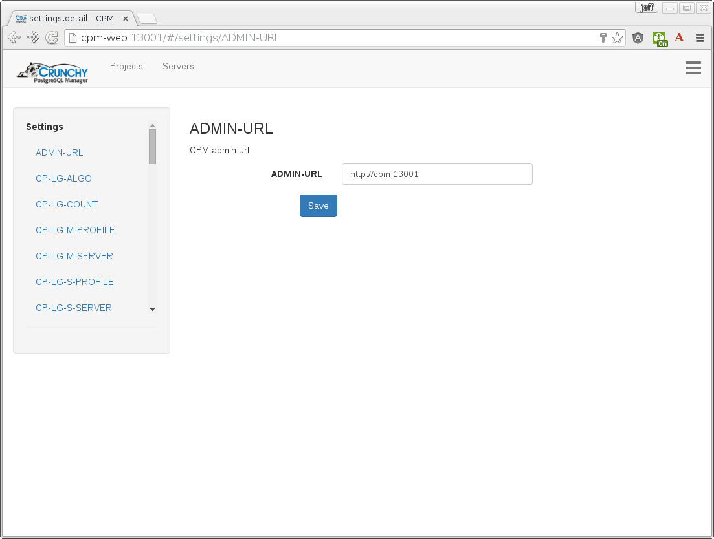
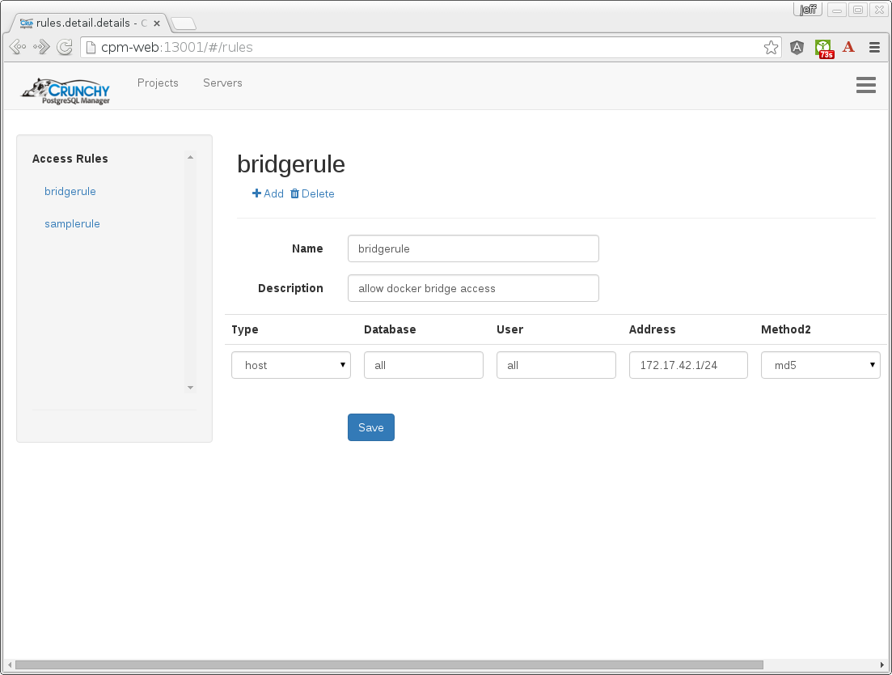
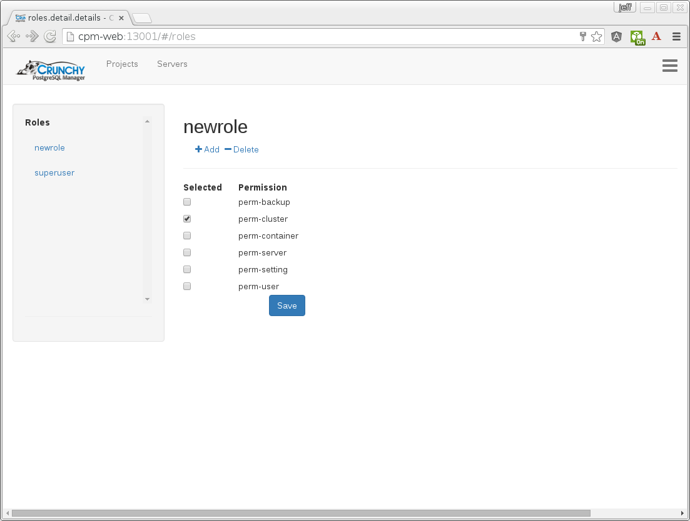

##Login Page
The screen below is what you will see when you first
navigate to the CPM URL.  In this example, the URL
is http://cpm:13001

The dropdown menu on the right side is displayed in this
screenshot.  Selecting the Login button will take you to the
Login Prompt.

##Login Prompt
The Login Prompt is where you will enter your CPM user credentials.
By default, the user ID is cpm, the password is cpm, and the
Admin URL is http://cpm-admin:13001

##CPM Database Access Rules
The Database Access Rules page shows the current Postgresql pg_hba.conf
rules that are in effect for this database.  All available Access Rules
are shown, you select or deselect the rules to determine the configuration.
After you Save the rules, CPM will stop the database, apply the rules
to the pg_hba.conf, and then restart the database for them to
become active.

##CPM Database Monitoring
The Database monitoring page shows various monitoring information
that is available.  Select the monitoring button and the metrics
will be fetched from the database and displayed.

##CPM Database Users
The Database Users page shows Postgresql users that are defined
for this database.

##CPM Database Schedules
The Database Schedules page shows administrative tasks that you
have scheduled for this database.  Currently only the pg_basebackup
task is available to be scheduled.  In the future, other admin tasks
will be made available here such as vacuum, archive, reporting, etc.

##CPM Servers
The CPM Servers page shows the physical or virtual Linux servers that 
are defined to be used by CPM in deploying containers upon.  CPM
will deploy containers upon the servers defined here to provide multi-host
capability.

##CPM Servers Monitoring
The CPM Servers monitoring page shows the various server monitoring 
pages that are available.  Simple things like 'df' and 'iostat' are 
currently implemented.  These metrics are obtained directly from 
scripts running on the physical servers.

##CPM Settings
The CPM Settings page shows various CPM settings that determine
the run-time characteristics of CPM.  

##CPM Access Rules
The CPM Access Rules page lets you author a Postgresql pg_hba.conf
access rule that can then be used by the various database containers.

##CPM Users
The CPM Users page lets you define CPM web users.

##CPM Roles
The CPM Roles page lets you control CPM user roles and permissions.

